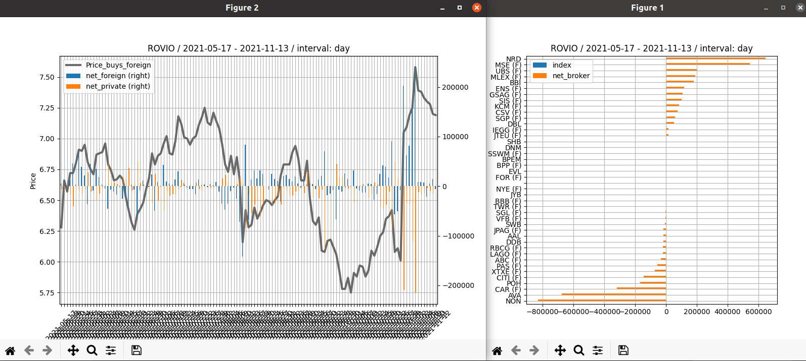

# Stock broker classifier
This script visualizes trades for an individual stock by categorizing trades by broker codes. Aim of the script is to present which broker is bying and selling the stock. The script was created entirely as a hobby.

Default classification divides the brokers into the two classes: private brokers and foreing/institutional brokers. The result charts presents the class volumes over the time.



## Data source

The stock data is fetch from the open data api of the Nasdaq site (http://www.nasdaqomxnordic.com/).

The api returns data about for the last six months.

## Usage

Plot an hourly chart for the last 10 days: ```python3 fetch.py rovio 10 -hourly```

Plot an daily chart for the last 180 days: ```python3 fetch.py rovio 180 -daily```

Use the Nasdaq instrument code: ```python3 fetch.py HEX144044 90 -daily``` 

## Libraries
- requests
- pandas
- matplotlib